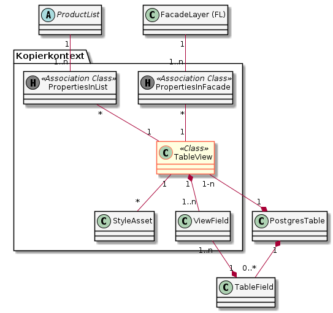

# SIMI

Webapplikation zur Pflege der Metainformationen der GDI-SO (**S**patial **I**nfrastructure **M**etadata **I**nterface)

Die Doku des Metamodells ist hier zuhause: [Doku des Metamodelles](metamodel.md)

## Konfigurieren und Starten

Die Konfiguration erfolgt mittels der folgenden Umgebungsvariablen:

* **Konfiguration der Verbindung auf die Meta-DB:**
  * CUBA_DATASOURCE_USERNAME: Benutzername der DB-Connection. Bsp: "postgres"
  * CUBA_DATASOURCE_PASSWORD: Passwort der DB-Connection. Bsp: "postgres"
  * CUBA_DATASOURCE_DBNAME: Name der Datenbank. Bsp: "simi"
  * CUBA_DATASOURCE_HOST: Name des Hosts des Postgres-Clusters. Bsp: "localhost"
  * CUBA_DATASOURCE_PORT: Nummer des Ports des Postgres-Clusters. Bsp: 5432
* **Konfiguration der Authentifizierung (LDAP, ...):**
  * CUBA_WEB_LDAP_ENABLED: LDAP Authentifizierung aktiv? Bsp: TRUE / FALSE
  * CUBA_WEB_LDAP_URLS: LDAP URL. Bsp: LDAP://192_168_1_1:389
  * CUBA_WEB_LDAP_BASE: Distinguished Name, auf welchen gebunden wird. Bsp: OU=EMPLOYEES,DC=MYCOMPANY,DC=COM
  * CUBA_WEB_LDAP_USER: Benutzer, mit welchem verbunden wird. Bsp: CN=SYSTEM USER,OU=EMPLOYEES,DC=MYCOMPANY,DC=COM
  * CUBA_WEB_LDAP_PASSWORD: Passwort, mit welchem auf das LDAP verbunden wird.
  * CUBA_WEB_LDAP_USERLOGINFIELD: Name des Attributes im LDAP-Verzeichnis, welches gegen den Login-Namen 
  verglichen wird. Bei AD häufig "sAMAccountName".
  * CUBA_WEB_REQUIREPASSWORDFORNEWUSERS: Muss bei LDAP Auth auf false gesetzt sein, damit kein "Kuba Passwort" für
  den Benutzer verlangt wird.
  * CUBA_WEB_STANDARDAUTHENTICATIONUSERS: Komma getrennte Liste der Benutzer, welche trotz aktiviertem LDAP-Login mittels Standard 
  (cuba) Login authentifiziert werden. 
* **Konfiguration der URL des Schemareaders:**
  * SIMI_SCHEMAREADER_URL: Url, auf welcher der Schemareader erreichbar ist. Bsp: "http://localhost/schemareader"
* **Konfiguration des Publikations Jenkins-Jobs:**   
  * SIMI_PUBLISHJOB_BASEURL: Basis-URL des Jobs im Jenkins, welcher die Konfiguration publiziert
  * SIMI_PUBLISHJOB_POLLTIMEOUT: Timeout des Pollings auf den gestarteten Job \[ms\]. Grund: Neue Jobs landen bei 
  Jenkins zuerst in der Queue und werden erst nach einer Weile (lastabhängig) abgearbeitet.  
  * SIMI_PUBLISHJOB_SECTOKEN: Security-Token, mit welchem Jenkins das Starten des Jobs erlaubt. 
* **Konfiguration der Suche in den GRETL-Repos (Anzeige der Abhängigkeiten):**
  * SIMI_GITSEARCH_URL: Url, auf welche die Git-Suchen abgesetzt werden. Bsp: "https://api.github.com/search/code"
  * SIMI_GITSEARCH_REPOS: Liste aller zu durchsuchenden Git-Repos, mittels "|" getrennt. Bsp: "sogis/gretljobs|oereb/jobs"
* **Weitere...**
  * SIMI_CONFIG_STOPONINCOMPLETE: Falls "true" fährt simi bei fehlenden Konfigurationsparametern nicht hoch.
  
## Kopieren von Data-Products

Die im GUI harmlos erscheinende Kopierfunktion ist aufgrund der vielen zu berücksichtigenden Beziehungen
ziemlich komplex.

Die Klassen innerhalb des Kopierkontextes werden kopiert (dupliziert), die ausserhalb werden referenziert. 
Nach dem Kopiervorgang zeigt also sowohl das Original wie auch die Kopie auf das gleiche ausserhalb des
Kopierkontextes liegende Objekt.

Hinweis: Die Vererbungen sind in den Diagrammen nicht abgebildet.

### Tableview

### Rasterview

### FacadeLayer

### Layergroup

### Map

